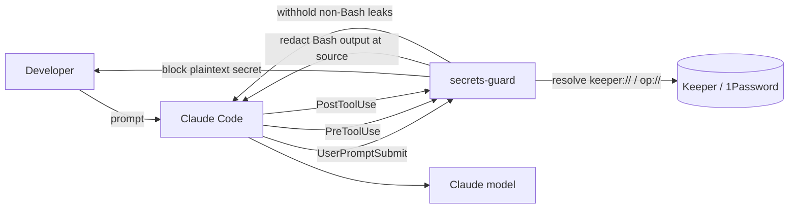

# secrets-guard

> Keep secrets out of the model. A Claude Code plugin marketplace for security.

[](https://github.com/hsoftai/hsoft-claude-plugins/actions/workflows/ci.yml)
[](LICENSE)
[](https://goreportcard.com/report/github.com/hsoftai/hsoft-claude-plugins)

`secrets-guard` is a [Claude Code](https://docs.claude.com/en/docs/claude-code) plugin that stops
secrets from reaching the model — and a marketplace meant to host more security plugins over time.

It does three things, at the exact moments a secret could leak:

1. **Blocks prompts** that contain a plaintext secret, and tells you to use a vault reference instead.
2. **Resolves vault references** (`keeper://…`, `op://…`) into tool input at execution time, so the
   **model only ever sees the reference**, never the value.
3. **Redacts secrets in tool output** before the model sees them.

It works with **Keeper Secrets Manager** and **1Password** (first found wins), needs no API keys, and
is configured entirely from `managed-settings.json` — so you can roll it out across an org with Intune.

---

## How it works



| Hook | What it does | Mechanism |
|------|--------------|-----------|
| `SessionStart` | Self-install the `secrets-guard` CLI into the user's terminal PATH (Linux/macOS/Windows, no admin) | idempotent copy |
| `UserPromptSubmit` | Block a prompt containing a plaintext secret | `decision: block` |
| `PreToolUse` | Resolve vault references → inject value for execution | `updatedInput` |
| `PreToolUse` | Deny a tool call carrying a plaintext secret | `permissionDecision: deny` |
| `PreToolUse` (Bash) | Wrap the command so its output is redacted at the source | `updatedInput` |
| `PostToolUse` | Withhold non-Bash tool output that leaks a secret | `decision: block` |

> **Why Bash output is redacted via `PreToolUse` and not `PostToolUse`:** Claude Code 2.1.x does not
> honor client-side rewriting of tool *output* (`updatedToolOutput`). secrets-guard therefore redacts
> Bash output by wrapping the command (which *is* honored), and withholds output for non-Bash tools.
> For inline redaction across *all* tools and surfaces (including the web app), pair this plugin with a
> network DLP gateway. See [docs/architecture.md](docs/architecture.md).

## Detects

**Zero false positives by design.** Detection only matches secrets whose structure is
unambiguous — reserved unique prefixes (AWS `AKIA…`, GCP `AIza…`, GitHub `ghp_…`,
Slack `xox…`, Stripe `sk_live_…`, Anthropic `sk-ant-…`), PEM private keys, JWTs, and
strict keyword+format pairs (`aws_secret_access_key = <40 base64>`, Azure
`AccountKey=<88 base64>`). It will never block a filename, identifier, path or
sentence. Detection is a best-effort *plus*; the core feature (vault resolution) does
not depend on it. Add organization-specific patterns with `custom_patterns_path` —
deliberately opt-in, so the defaults stay false-positive-free.

## Discover and use secrets (never see the value)

A bundled MCP server + skill let you ask Claude to *use* a secret without the
value ever entering the chat. You ask for a secret, Claude lists the catalog,
gets the reference, and puts it in a tool — the hook resolves it at execution.

MCP tools (return references and labels, **never values**):

| Tool | Returns |
|------|---------|
| `vault_status` | which vault is active |
| `list_accounts` | available accounts (1Password) |
| `list_secrets` | item titles / ids (optional `account`) |
| `list_fields` | an item's fields + ready-to-use `op://` / `keeper://` references |

**Files vs commands.** Write/Edit keep the reference in the file (the value never
touches disk); Bash commands resolve the value at execution and redact it from the
output. To run an app that reads secrets from the environment, launch it through
the resolver — references stay in `.env`, values are injected into the process
only:

**Keeping a reference literal in a command.** By default, a `op://…` / `keeper://…`
reference inside a Bash command is replaced by its value at execution. Sometimes you
want the *reference itself* to stay in the command — e.g. writing a script that calls
`op read "op://…"`, or `secrets-guard run`. secrets-guard handles this automatically
and gives you control:

- Commands that **resolve references themselves** (`op read`, `op inject`, `op run`,
  `ksm secret notation`, `ksm exec`, `secrets-guard read`, `secrets-guard run`) keep
  the reference literal — injecting the value would break them.
- **Escape a single occurrence** with a leading backslash: `\op://vault/item/field`
  is kept literal (the backslash is stripped); every other occurrence still resolves.
- Set `command_references: keep` to keep **all** references literal in commands.

In every case the reference is still resolved *internally*, so if the value reaches
the command's output it is redacted to `[REDACTED BY SECRETS-GUARD]` — keeping a
reference literal never weakens output redaction.


```sh
secrets-guard run --env-file .env -- python app.py     # op-run / ksm-exec, unified
secrets-guard read op://Private/db/password            # resolve one reference (op read / ksm notation)
```

The CLI is on PATH inside Claude Code automatically. It is also installed into
**your own terminal's PATH automatically** the first time a Claude Code session
starts with the plugin enabled — on Linux, macOS **and Windows**, user-level, with
**no administrator rights**. So just installing/enabling the plugin (including when
enforced org-wide via `managed-settings.json`) is enough to get the `secrets-guard`
command in your shell; open a new terminal after the first session.

- Linux/macOS: copied to `~/.local/bin` (added to your shell rc if not already on PATH).
- Windows: copied to `%LOCALAPPDATA%\secrets-guard\bin` and added to your user PATH
  (`HKCU\Environment`).

If you ever need to (re)install it manually:

```sh
./install.sh                 # Linux/macOS: copies the binary to ~/.local/bin
# or, from inside Claude Code (any OS):  secrets-guard install
```

References can embed the account so several accounts work at once:
`op://<account>:<vault>/<item>/<field>`. For multiple 1Password accounts on one
machine, set `op_account` (or `OP_ACCOUNT`), or just use the account-embedded
reference `list_fields` returns.

## Install

From the marketplace:

```sh
claude plugin marketplace add hsoftai/hsoft-claude-plugins
claude plugin install secrets-guard@hsoft-claude-plugins
```

Or enforce it org-wide via `managed-settings.json` (recommended) — see
[docs/managed-settings.md](docs/managed-settings.md).

## Configure

Every option is set as a `CLAUDE_PLUGIN_OPTION_*` environment variable in `managed-settings.json`,
or interactively with `/plugin configure secrets-guard@hsoft-claude-plugins`.

| Option | Default | Values |
|--------|---------|--------|
| `vault_provider` | `auto` | `auto`, `keeper`, `1password` |
| `op_account` | – | 1Password account for machines with multiple accounts (shorthand/URL/ID) |
| `block_on_prompt_secret` | `true` | `true`, `false` |
| `tool_input_policy` | `deny` | `deny`, `redact`, `warn` |
| `tool_output_mode` | `redact` | `redact`, `block`, `off` |
| `command_references` | `inject` | `inject` (replace refs in Bash commands with the value), `keep` (leave refs literal) — see below |
| `custom_patterns_path` | – | JSON file of `{category, pattern}` |
| `allowlist_path` | – | file of regexes (one per line) |
| `audit_log_path` | – | path for value-free JSON-line audit log |

## Build from source

```sh
cd src
go test ./... -race
go build -o ../plugins/secrets-guard/bin/secrets-guard-<os>-<arch> ./cmd/secrets-guard
```

CI cross-compiles all platforms; see [.github/workflows/ci.yml](.github/workflows/ci.yml).

## Contributing

Contributions are welcome — new detectors, vault providers, and security plugins for the marketplace.
Read [CONTRIBUTING.md](CONTRIBUTING.md) and our [Code of Conduct](CODE_OF_CONDUCT.md). To report a
vulnerability, see [SECURITY.md](SECURITY.md).

## License

[MIT](LICENSE) © Humphrey Consulting Group SAS
