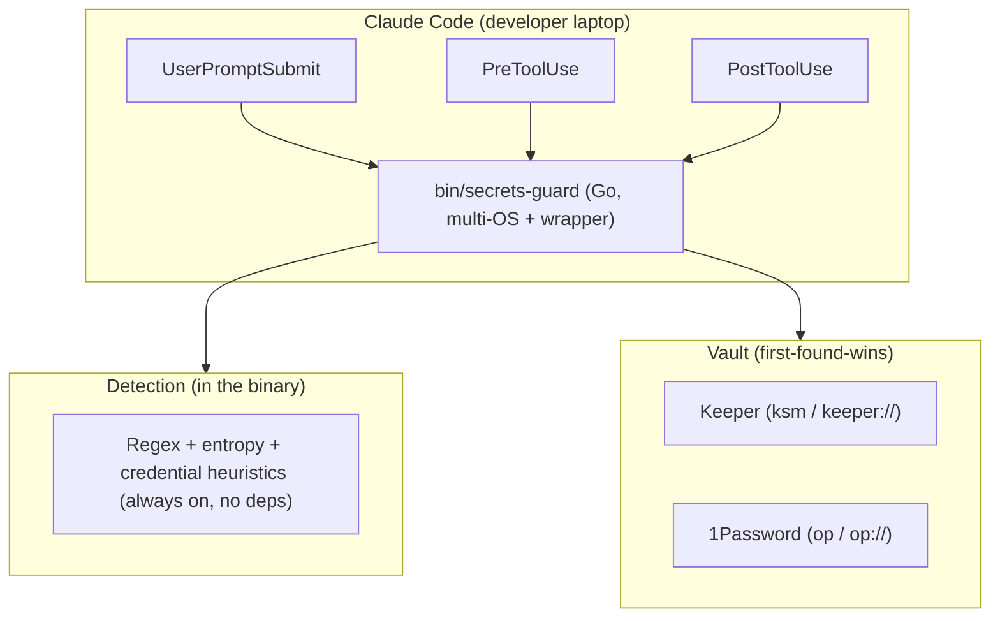

# Architecture

secrets-guard is a single Go binary invoked by three Claude Code hooks. It is one
client-side layer of a defense-in-depth design.



## What runs at each hook

| Hook | Trigger | Action |
|------|---------|--------|
| `UserPromptSubmit` | user submits a prompt | scan; if a plaintext secret is present → `decision: block` (the prompt never reaches the model) |
| `PreToolUse` | before any tool runs | (1) plaintext secret in input → `permissionDecision: deny` (policy `deny`/`redact`/`warn`); (2) resolve `keeper://`/`op://` references via the vault → `updatedInput`; (3) for Bash in `redact` mode, wrap the command so its output is redacted at the source |
| `PostToolUse` | after a tool runs | scan the result; if a secret leaked → `decision: block` (withhold) for non-Bash tools |

## The PostToolUse constraint (important)

Claude Code 2.1.x **does not honor client-side rewriting of tool output**. We
verified empirically that a `PostToolUse` hook returning
`hookSpecificOutput.updatedToolOutput` does **not** change what the model sees.

Consequences, and how secrets-guard works around it:

- **Bash output** is redacted **inline** by wrapping the command in `PreToolUse`
  (which *is* honored). The wrapper preserves the exit code and keeps stdout/stderr
  separate:

  ```sh
  __sg_o=$(mktemp); __sg_e=$(mktemp)
  { <original command>; } >"$__sg_o" 2>"$__sg_e"; __sg_rc=$?
  secrets-guard redact-stream <"$__sg_o"
  secrets-guard redact-stream <"$__sg_e" >&2
  rm -f "$__sg_o" "$__sg_e"; exit $__sg_rc
  ```

- **Non-Bash tool output** (Read, Grep, WebFetch, …) cannot be rewritten
  client-side, so a leaked secret there is **withheld** (`decision: block`).

- For **inline redaction across all tools and the web app**, pair secrets-guard
  with a **network DLP gateway** (e.g. an `ANTHROPIC_BASE_URL` reverse proxy or a
  TLS-intercepting forward proxy) that redacts the `/v1/messages` payload. That
  gateway is the un-bypassable backstop; this plugin is the fast, local first line.

## Vault injection flow

```mermaid
sequenceDiagram
    participant M as Claude model
    participant CC as Claude Code
    participant SG as secrets-guard
    participant V as Keeper / 1Password
    M->>CC: tool_use Bash, command contains keeper://UID/field/password
    CC->>SG: PreToolUse(tool_input)
    SG->>V: resolve keeper://UID/field/password
    V-->>SG: real value
    SG-->>CC: updatedInput (value injected; + Bash output wrap)
    Note over SG: model only ever saw the reference
    CC->>CC: execute tool with real value
```

## Detection

Dependency-free regex embedded in the binary, microsecond latency, runs on every
hook including the per-command wrap.

**Zero false positives by design.** Only secrets with an unambiguous structure are
matched: reserved unique prefixes (AWS `AKIA…`, GCP `AIza…`, GitHub `ghp_…`/`github_pat_…`,
Slack `xox…`, Stripe `sk_live_…`, Anthropic `sk-ant-…`), PEM private-key blocks,
JWTs, and strict keyword+format pairs (`aws_secret_access_key = <40 base64>`,
`AccountKey=<88 base64>`). None of these can collide with a filename, identifier,
path or sentence. Loose heuristics (natural-language passwords, generic
`key=value`, credential URLs, entropy guessing) are intentionally excluded — they
caused false positives that blocked developers, and the core feature does not need
them. Add org-specific patterns with `custom_patterns_path` (opt-in) and silence
any value with `allowlist_path`.

## Trust boundary

Resolved secret values reach the local process that executes the tool — that is
unavoidable, since the tool needs them. secrets-guard guarantees the **model**
never sees the value (it saw only the reference) and that leaked values are kept
out of the model's context. It does not encrypt secrets on the host.
